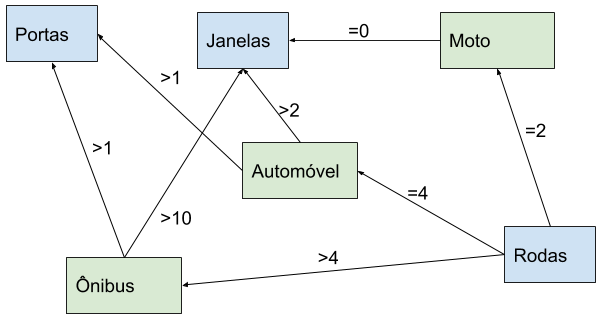

###Utilize regras de produção para construir uma base de conhecimento para um SBC capaz de determinar se uma pessoa está cansada, com fome ou com sede.

- SE bocejo --> cansado
- SE olheiras --> cansado
- SE olhos_vermelhos_sim E bocejo --> cansado
- SE olhos_vermelhos_sim E bocejo e olheiras --> cansado
- SE confusao_mental_sim --> cansado
- SE 18_horas_sem_dormir --> cansado
- SE 6_horas_sem_comer --> fome
- SE barriga_roncando --> fome
- SE boca_seca_sim --> sede
- SE exercitou --> sede

###Utiliza uma rede semântica para criar uma base de conhecimento para um SBC capaz de identificar se um veículo é uma motocicleta, um automóvel de passageiros ou um ônibus.

