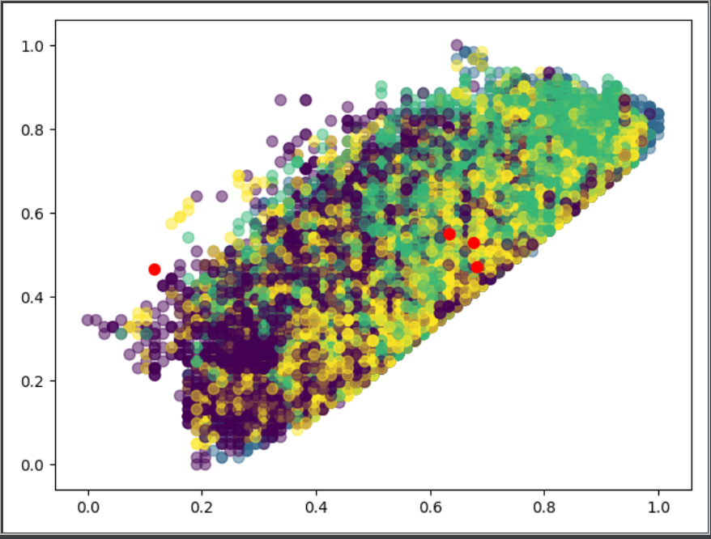

## Atividade
As particulas PM2.5 representam os elementos poluentes em suspensão no ar mais prejudiciais à saúde da população, sendo responsáveis pela maioria das doenças respiratórias por intoxicação poluente.
Dados: O arquivo PRSA_data_2010.1.1-2014.12.31.csv contém um conjunto de dados sobre as condições atmosféricas em Hong Kong entre os anos 2010 a 2014, contando com a concentração de PM2.5 no ar (em Partículas por Milhão).
Pede-se:
- Identifique os quadrantes de concentração de PM2.5, Considere o quarto (maior) quadrante deve ser considerado o mais nocivo.
- Utilize analise de Cluster para determinar as características atmosféricas para cada condição (qudrante) de concentração de PM2.5
- Realize a análise de Cluster sem a determinação das classes (quadrantes) e compare os dois resultados
- Aponte a indicação de uso das duas análises, quais são as condições para sucesso, quais as perguntas que cada análise pode responder e quais são as limitações impostas pelos dois diferentes resultados

## Resultado

````
[[ 6.33990903e-01  5.51022174e-01  4.73485650e-01  4.43359609e-01
   7.08369106e-02  5.11341293e-01  4.39564136e-01  5.24822586e-01
   8.35631235e-02  1.26538639e-03  7.74216675e-03 -8.68749517e-15
   1.00000000e+00  9.85322934e-15  9.06219544e-15  1.84297022e-14
   1.00000000e+00  3.45834472e-14  1.62092562e-14]
 [ 1.16892814e-01  4.64917997e-01  4.98606133e-01  4.99417470e-01
   1.03494066e-01  6.19255946e-01  5.13658404e-01  4.58813170e-01
   4.80762650e-02  2.52223550e-03  6.38855702e-03  3.57654890e-01
  -3.77475828e-14  3.49462366e-01  2.92882744e-01  1.07782898e-01
   3.43915344e-01  3.55265404e-01  1.93036354e-01]
 [ 6.81268012e-01  4.70500393e-01  4.94476465e-01  5.90819864e-01
   1.08497285e-01  6.87817144e-01  5.96993748e-01  4.02158763e-01
   2.99476694e-02  3.22339631e-03  3.09798271e-03 -6.56419363e-15
   1.00000000e+00  1.00197628e-14  1.18099974e-14  1.90403249e-14
  -7.11097847e-14  1.00000000e+00 -2.05391260e-15]
 [ 6.75135135e-01  5.28309136e-01  4.88871417e-01  4.60792650e-01
   1.11130765e-01  6.27699089e-01  5.01843960e-01  4.70976994e-01
   6.42766523e-03  1.03376103e-03  4.49358449e-03 -8.79851747e-15
   1.00000000e+00  9.97812943e-15  1.11854970e-14  3.43292383e-01
  -7.03326286e-14  3.64708264e-14  6.56707617e-01]]`
````


